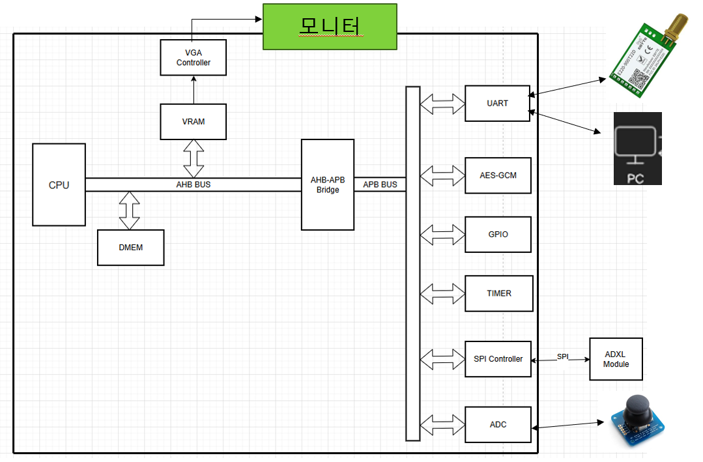

# SoC AI Development Flow

This repository is the publishable source of truth for a personal FPGA SoC project. It contains specifications, project-authored RTL and firmware, redistributable third-party RTL with notices, portable verification sources, and reviewed reports.

The canonical engineering environment is WSL Ubuntu with Codex. RTL/firmware development, Verilator checks, vendor CLI invocation, ModelSim/XSim simulation, result analysis, and engineering-report generation originate there. Antigravity independently develops DV from the approved specifications. Windows Work consumes reviewed evidence for portfolio documents, PDF/PPT material, and interview preparation; it may assist with GUI-only vendor operations, but it is not the canonical build or engineering-report owner.

## Hardware Overview

The active FPGA baseline integrates a custom RV32I SoC around a 5-stage pipelined CPU, an AHB-Lite bus fabric, dedicated memory and display subsystems, and an APB peripheral subsystem.



> **Diagram scope:** This diagram provides a simplified architectural overview. The canonical architecture, memory map, and interface contracts are defined in [`spec/`](spec/README.md) (specifically [`spec/00_soc_architecture.md`](spec/00_soc_architecture.md), [`spec/01_memory_map.md`](spec/01_memory_map.md), and [`spec/08_vga.md`](spec/08_vga.md)). In case of disagreement, the specifications take precedence.


Key baseline subsystems:
- **RV32I 5-Stage CPU Core:** In-order 5-stage pipeline with local instruction memory and an AHB-style load/store memory-access interface with precise bus fault trap handling (`mcause=5/7`).
- **AHB Data Memory (DMEM):** 32 KiB on-chip data memory directly attached to the AHB fabric.
- **VGA / Dual-VRAM Display Subsystem (`AHB_VRAM_DUAL_BUFFER`):** 640×480 @ 60 Hz 1-bpp monochrome display pipeline driven by an independent 25 MHz pixel clock (`pclk_25`), dual physical mixed-width block RAMs, atomic frame-wrap buffer swapping `(799,524)->(0,0)`, an autonomous 9,600-word hardware clear engine, and sticky W1C status registers.
- **AHB-to-APB Bridge:** Converts AHB transfers within the canonical `0x4000_0000`–`0x400F_FFFF` APB aperture to APB bus cycles; reserved slots return an error.
- **APB Peripherals:** Memory-mapped controllers for UART (115200 baud), GPIO (pushbuttons, switches, LEDs), System Timer, ADXL345 G-Sensor interface, ADC (analog joystick / temperature sensor), AES-GCM 128-bit cryptographic accelerator, and 6-digit 7-segment HEX display.

## Hardware Demos

Physical FPGA board demonstrations, execution captures, and development logs are published on the project owner's YouTube channel:

- **YouTube — FPGA / SoC / Embedded Project Demos:** https://www.youtube.com/channel/UC9DlYapKa23KqJkNadjSObQ

Demonstration recordings and photographs serve as supporting visual evidence confirming hardware bring-up on the physical DE10-Lite FPGA board. Engineering claims and verification statuses are substantiated by formal in-tree evidence packages:
- **P08B VGA Hardware Clear & W1C Status Integration:** Documented in [CS-009](docs/engineering/CS-009-p08b-vga-hwclear-w1c.md) with measured execution evidence in [P08B-VGA-EV-01](reports/evidence/vga-hwclear/summary.md).
- **Exact-Count HW Clear Verification:** The exact 9,600-word framebuffer clear count is verified by directed RTL simulation assertions ([`tb_p08b_vga.sv`](verification/directed/vga/tb_p08b_vga.sv)); the visible clear/swap sequence is documented separately by [board photographs](reports/evidence/vga-hwclear/board/).

*Visual demonstrations illustrate observable screen behavior; they do not prove internal bus protocol compliance, CDC clock-domain crossing safety, or static timing analysis (STA) sign-off. All technical contracts remain governed by simulation assertions, timing reports, and formal verification evidence.*

## Planned Implementation Roadmap

The implementation roadmap outlines the structured engineering trajectory for post-baseline SoC evolution. This sequence represents a **forward-looking working plan, not currently implemented features**:

1. **PLIC and CPU External Interrupt Path:**
   - Define platform-level interrupt controller (PLIC) gateway and memory-mapped register architecture.
   - Integrate peripheral interrupt lines (UART, timer, GPIO, display VSync) into CPU trap entry.
   - Validate CSR handling, vectored/direct interrupt dispatch, and ISR drivers.
2. **AXI Interconnect Migration:**
   - Introduce target AXI4 interconnect fabric with multi-master arbitration policies.
   - Preserve existing APB peripherals via an AXI-to-APB bridge.
3. **Multi-Channel DMA and AXI Arbitration:**
   - Implement an AXI master direct memory access (DMA) engine with configurable channels.
   - Establish hardware scheduling, round-robin/priority arbitration, and software control registers.
   - Verify bus back-pressure, transfer contention, transfer completion, and error responses.
4. **External SDRAM Subsystem:**
   - Integrate the SDRAM controller into the AXI memory address map.
5. **DMA Staging and Buffer Data Path:**
   - Define structured internal buffering paths between CPU DMEM, VRAM, DMA, and external SDRAM.
   - Eliminate redundant CPU memcpy overhead during frame generation and peripheral data streaming.
6. **Data Cache (D-Cache) Controller:**
   - Introduce a multi-way set-associative data cache architecture following external memory stabilization.
   - Implement cache line refill, write-through/write-back policies, invalidation, and flush mechanisms.
   - Define cache coherency interactions with DMA and software cache-maintenance operations.
7. **System-Level Integration and Performance Closure:**
   - Expand open-source regression testbenches and independent UVM verification coverage.
   - Reconcile cross-domain CDC paths, reset synchronization, and terminal error propagation.
   - Measure real-hardware Fmax, resource utilization, memory bandwidth, and IPC benchmark metrics.

*Note: This roadmap is an engineering working plan. Prior to baseline integration, each milestone must strictly complete the defined development lifecycle: Specification ➔ RTL/Firmware Implementation ➔ Independent DV / Simulation ➔ FPGA Synthesis & Timing Closure ➔ Measured Board Evidence ➔ Milestone Review.*


## Repository boundary

```text
$PUBLIC_REPO  publishable spec/RTL/FW/verification and reviewed reports
$VENDOR_ROOT private licensed/generated Quartus or Vivado project state
$RUN_ROOT    raw builds, logs, waves, reports, and temporary outputs
export/      reviewed artifacts intentionally handed to another environment
```

The private build relationship is:

```text
PUBLIC_REPO + PRIVATE_VENDOR_PROJECT + LOCAL_ENV + RUN_DIR
= PRIVATE FULL FPGA BUILD
```

The open-source relationship implemented in Phase 3 is:

```text
PUBLIC_REPO + PUBLIC BEHAVIORAL MODELS
= OPEN LINT / SIMULATION / ELABORATION
```

No complete vendor GUI project, generated vendor HDL, or vendor simulation collateral is published here. See [the FPGA boundary](fpga/README.md), [third-party notices](THIRD_PARTY_NOTICES.md), and [verification status](verification/README.md).

## Start here

- [Specifications](spec/README.md)
- [RTL](rtl/README.md)
- [Firmware](firmware/README.md)
- [Verification](verification/README.md)
- [Scripts](scripts/README.md)
- [Reports](reports/README.md)
- [Engineering case studies](docs/engineering/README.md)
- [Git workflow](docs/GIT_WORKFLOW.md)
- [Engineering roles](docs/AGENT_ROLES.md)
- [Current status](docs/status/current_status.md)
- [한국어 안내](README.ko.md)

## Current release status

This is an in-progress source snapshot, not Clean Baseline v1 and not a vendor-free FPGA bitstream build. The frozen P08B VGA functional scope (`VGA-001..006`) is owner accepted with directed RTL/DV and board-visible smoke evidence, while CDC/STA, warning, reset-window, programmer-identity, and release work remain open. The CPU trap-policy Gate 0 is a scoped pass only after the startup `mtvec` installation commits; the pre-`mtvec` reset window remains a known, unverified risk. See [current status](docs/status/current_status.md) and [CS-009](docs/engineering/CS-009-p08b-vga-hwclear-w1c.md).

CPU and AES-GCM open-source dependencies are present with their licenses. Public simulation models cover private Intel/Altera memories, PLLs and ADC IP, while project-owned replacements cover VGA sync and GSensor helpers. A disposable private Quartus build binds the same public RTL to private vendor IP. Benchmark and Dhrystone source files are intentionally excluded. Any later performance report must be separately reviewed and must distinguish official Dhrystone 2.1 from the project's Dhrystone-style workload. See [Quartus build profiles](fpga/quartus/README.md) and [model contracts](docs/models/PORTABLE_MODEL_CONTRACTS.md).

Project-authored material is licensed under [Apache License 2.0](LICENSE). Third-party files retain the licenses documented in [THIRD_PARTY_NOTICES.md](THIRD_PARTY_NOTICES.md).
