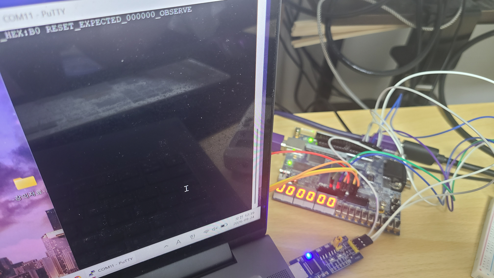
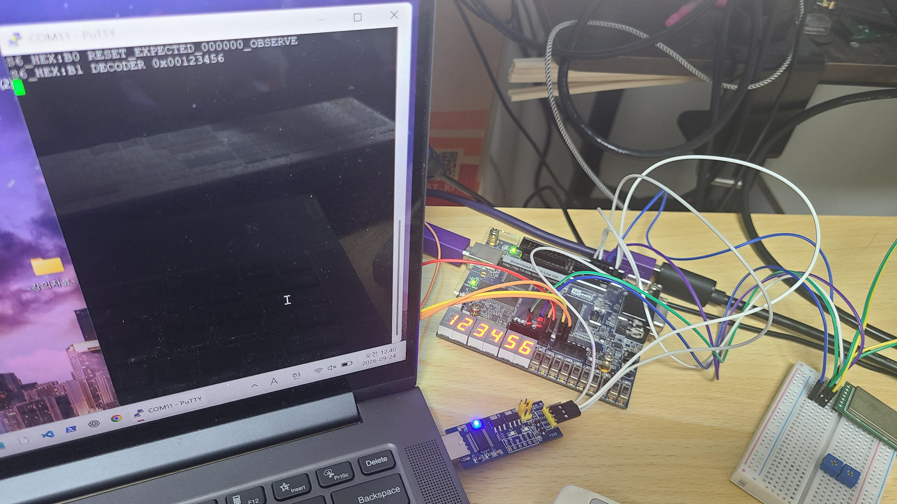
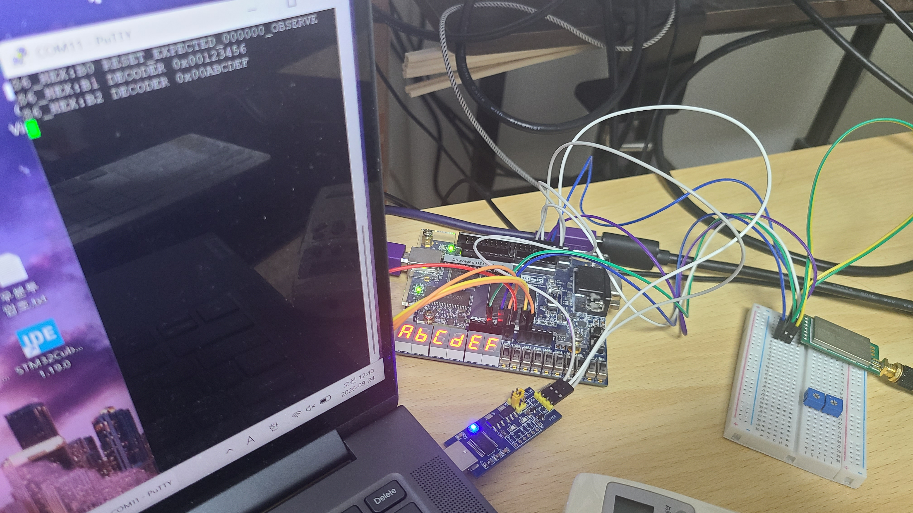
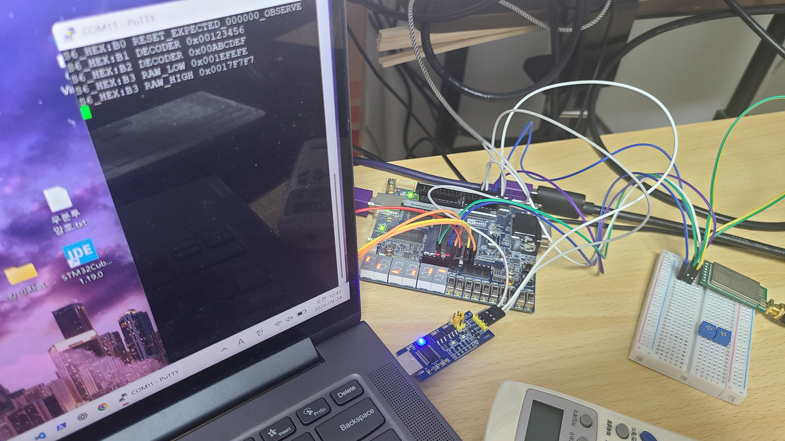
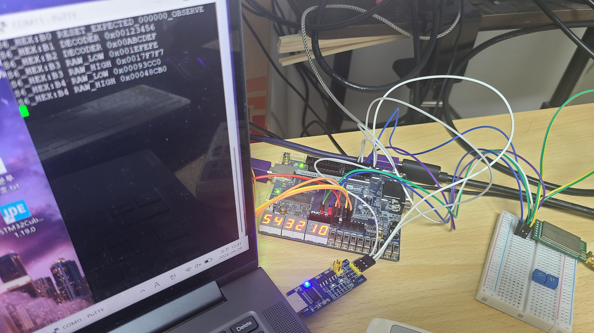
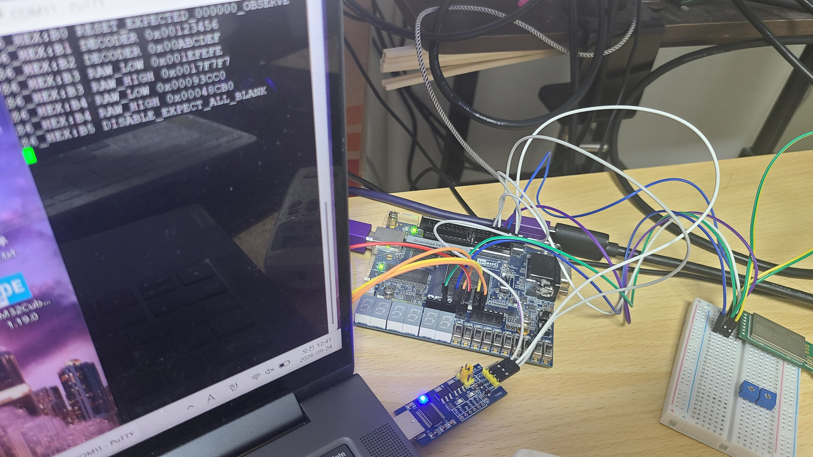
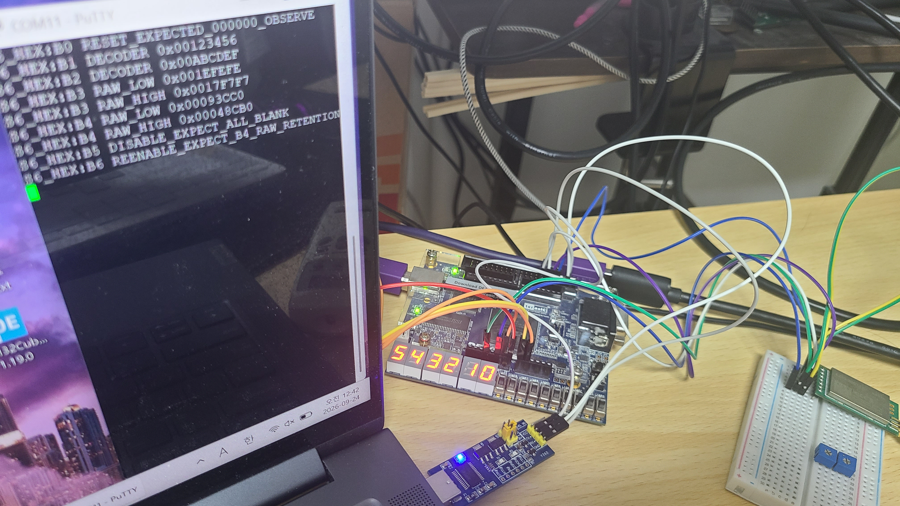
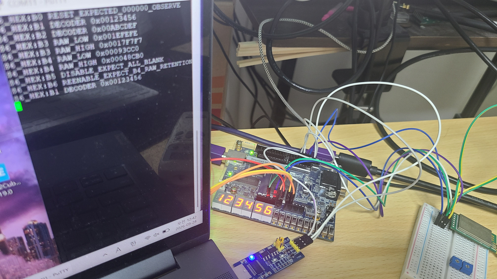
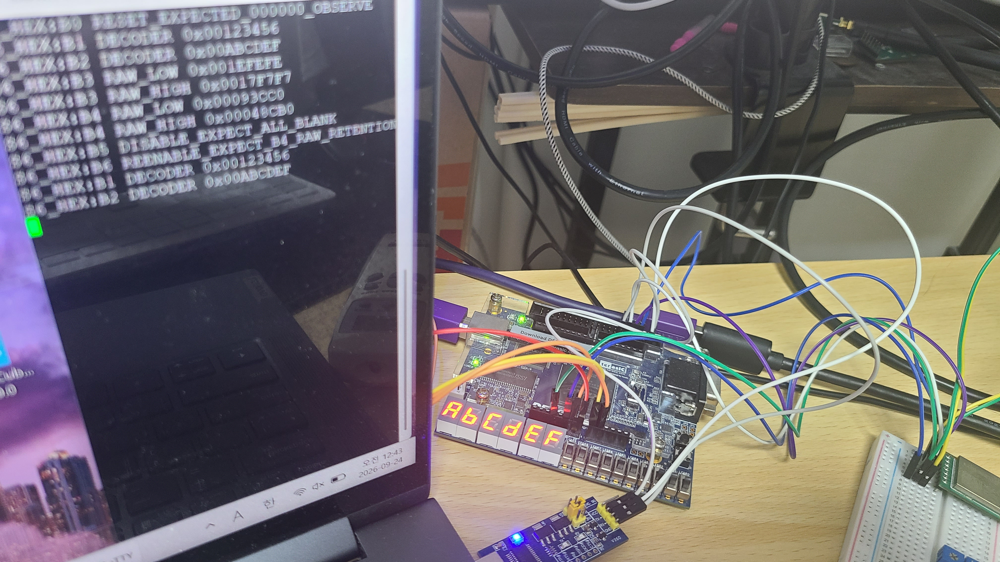

# P10 HEX S6 Board-Acceptance Evidence

## 1. Status

- Evidence ID: `P10-HEX-S6-EV-01`
- Scope: six-digit, seven-segment HEX cleanup build/pin/firmware/board function
- Result: `CONDITIONAL_PASS`
- Review status: `OWNER_CONFIRMED`
- Source identity: Public candidate base `128fc195aaf08c37a627835f185e5ae0400ac289` plus acceptance-app SHA-256 `6a1564f2e8e66289db841a8125d0fc340535975a2297e804beeac21bec691d69`

This package proves only the stated P10 HEX functional scope. It does not close
the tracker items that need directed RTL proof or RTL implementation, and it is
not a full FPGA timing/electrical release.

## 2. Final image and build identity

The final accepted rerun uses the S6 acceptance firmware image below. The public
repository intentionally excludes MIF/ELF/SOF binaries, private IP, generated
QSF payload, and raw Quartus/JTAG logs.

| Artifact | SHA-256 |
|---|---|
| ELF | `b204313326fcd8966495a55e5b1ab631ee74622e9bcb4d9f6bf2e5fcf45b0f9f` |
| IMEM.mif | `32b3b7aad4292b8bf426dd63875b6d6abdea7bef69cfa2a94ce2a226d3ef8dce` |
| DMEM.mif | `5bb95f76bdf77ef5e577e948bfea9c8b60b1bb3a9a05acf7a1e6a92e6b4f4c15` |
| SOF | `8ccfbbe74128e661d0a5e8892de0032eb3ca851fe3e1adb581121f2a31983607` |

The final private Quartus evidence recorded all generation/map/fit/asm/sta exits
as zero; the effective Fitter Pin report contains 42 unique `HEX0..HEX5[0:6]`
names and zero `HEX[7]` names. The board program/image association is
Owner-confirmed; no independent programmer log is published here.

## 3. Board photo sequence

The original-byte photographs were provided for publication by the Owner. UART
markers identify the held firmware state; each stage is approximately 2.5 s at
the 50 MHz baseline. The expected and observed visual result follows.

| State | Expected / observed result | Photo |
|---|---|---|
| B0 | reset `000000` before firmware HEX write |  |
| B1 | decoder `123456`, HEX0 is the least-significant `6` |  |
| B2 | decoder `ABCDEF` |  |
| B3 | distinct active-low RAW single-segment fields |  |
| B4 | multi-segment RAW values; left-to-right `543210` |  |
| B5 | ENABLE clear blanks all six displays |  |
| B6 | ENABLE restore re-shows retained B4 RAW state |  |
| B7 | next loop B1 returns to decoder `123456` |  |
| B8 | next loop B2 returns to decoder `ABCDEF` |  |

The B7/B8 records are the regression evidence for the earlier test-firmware bug:
the final app clears RAW mode before each loop's B1, rather than leaving B4 RAW
data selected.

## 4. Acceptance matrix

| Criterion | Evidence | Result |
|---|---|---|
| six x seven effective pin map, no DP `[7]` | final Fitter Pin report | PASS |
| reset display | B0 photograph and UART B0 marker | PHOTO_OBSERVED |
| decoder packing/order | B1, B2, B7, B8 photographs and UART markers | PHOTO_OBSERVED |
| RAW active-low packing/polarity | B3/B4 photographs and UART raw values | PHOTO_OBSERVED |
| disable blanking and data retention | B5/B6 photographs and UART markers | PHOTO_OBSERVED |
| repeated decoder after RAW path | B7/B8 photographs | PHOTO_OBSERVED |

## 5. Limitations / not proven

- Photographs do not prove every internal MMIO transaction, register readback,
  raw-field mask, or RTL-only target behavior.
- `HEX-002` directed RTL proof and `HEX-003` RTL target work remain outside this
  board-observation package; tracker status is not changed here.
- External I/O timing/electrical `STA-002` is not closed. ADC/VGA proximity,
  PLL and CDC work remain open.
- No oscilloscope or equivalent transient/glitch measurement was performed.

## 6. Traceability

- [Canonical HEX contract](../../../spec/16_hex_display.md)
- [Timing policy](../../../spec/timing_constraints.md)
- [Source integrity](source_hashes.sha256)
- [Structured result](result.json)
