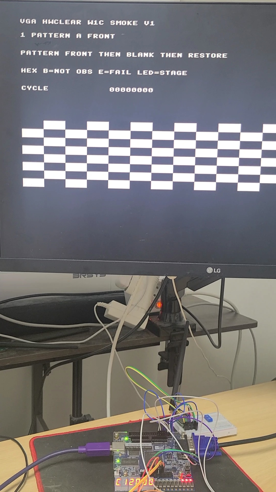
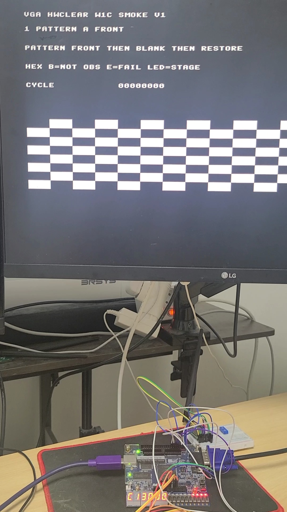
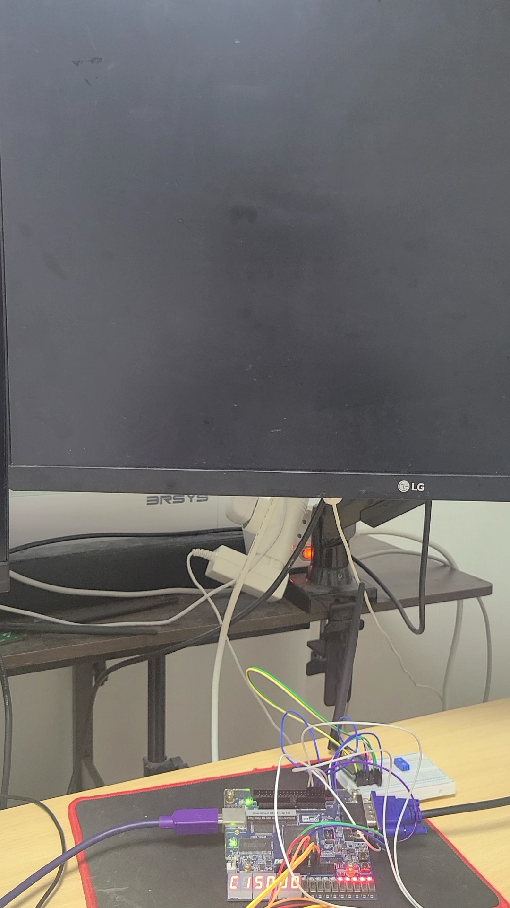
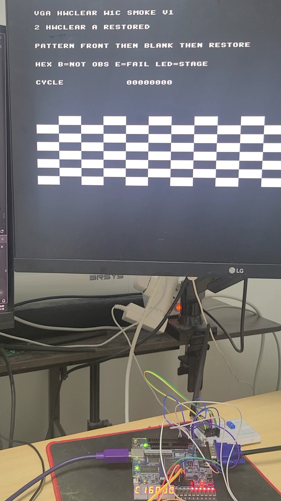
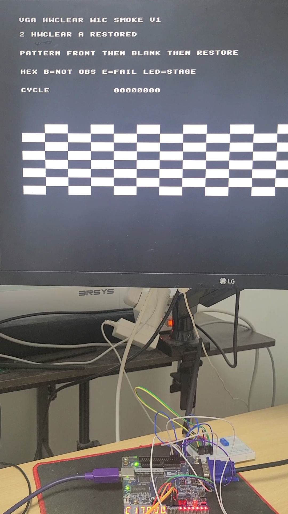
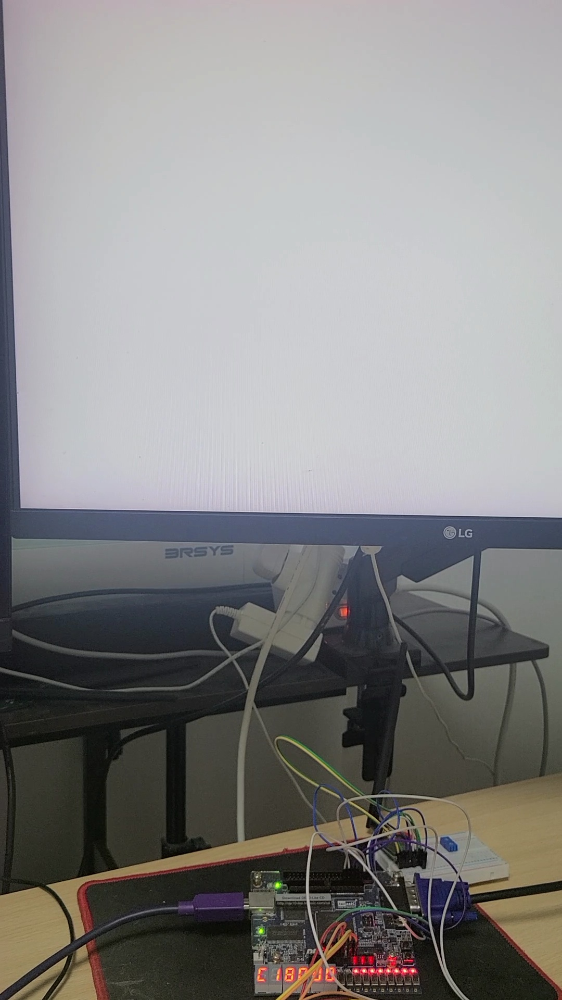
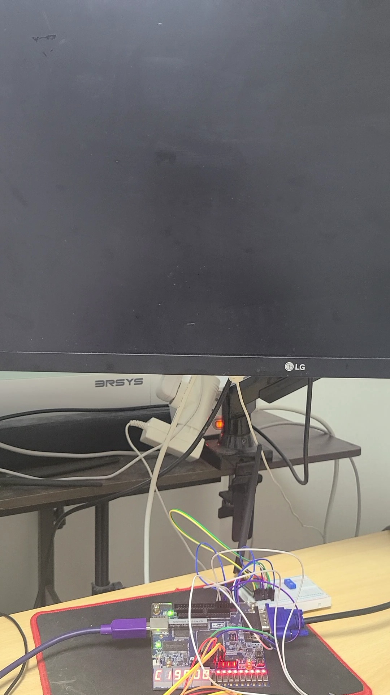
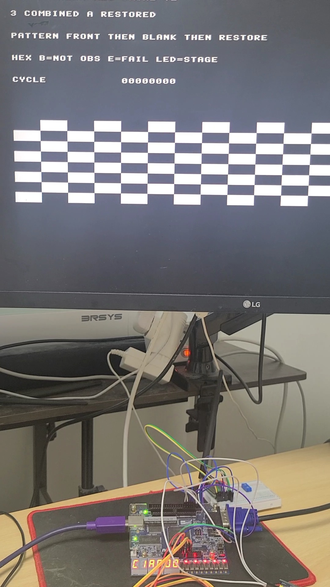

# P08B VGA HW Clear / W1C Evidence

## 1. Status

- Evidence ID: `P08B-VGA-EV-01`
- Requirements: `VGA-001..006`
- Criteria: `VGA-AC-01..08`
- Result: `CONDITIONAL_PASS`
- Review status: `APPROVED` for local frozen VGA functional scope
- Verified source revision: `f28e95df2eafcb939e04ffaca728c44f74c90612`

## 2. Scope and claim

The evidence combines same-RTL directed verification with a bounded board observation. Directed DV is the evidence for canonical access/error behavior, ownership, W1C behavior, and the exact 9,600-word clear. The board photos establish only the visible staged sequence; the user separately reported correct operation through cycle 5.

The third board diagnostic used an isolated firmware-only source, not a file in the frozen commit. Its source SHA-256 and programmed-image SHA-256 are recorded in `result.json`; no independent programmer/JTAG log binds that image to the pictured board.

## 3. Board photo sequence

| Stage | Expected visible result | Observation | Photo |
|---|---|---|---|
| C120 | Pattern A is front | Pattern A / cycle 0 visible |  |
| C130 | Pattern A holds while back is prepared | Pattern A remains visible |  |
| C150 | Standalone HW_CLEAR then swap | black screen |  |
| C160 | Pattern A restore | Pattern A visible |  |
| C170 | combined-operation setup | Pattern A visible |  |
| C180 | `SWAP + HW_CLEAR` publishes white B | white screen |  |
| C190 | next swap with no CPU framebuffer write | black screen |  |
| C1A0 | Pattern A restore | Pattern A visible |  |

The photo files are original-byte copies under explicit user approval. Their SHA-256 values are in `result.json`; the public repository contains no raw build logs, vendor payload, ELF, MIF, or SOF binary.

## 4. Method and acceptance results

| Criterion | Check | Result |
|---|---|---|
| `VGA-AC-01` | canonical aperture rejects aliases/gaps; read/subword policy | PASS — same-RTL directed DV |
| `VGA-AC-02` | busy/not-ready/rejected operation has no accepted side effect | PASS — same-RTL directed DV |
| `VGA-AC-03` | clear target is latched; combined sequence is ordered | PASS — same-RTL directed DV |
| `VGA-AC-04` | VSYNC, DONE, ABORT W1C and live BUSY/READY semantics | PASS — same-RTL directed DV; firmware path supplement |
| `VGA-AC-05` | cleaner commits words 0 through 9599 exactly once each | PASS — same-RTL H05 DV, not photo-derived |
| `VGA-AC-06` | HC01 nonzero-prefill → standalone clear → black | PHOTO_OBSERVED |
| `VGA-AC-07` | HC02 white B → no-framebuffer-write swap → black | PHOTO_OBSERVED |
| `VGA-AC-08` | repeat sequence through cycle 5 | USER_ATTESTED |

## 5. Limitations / not proven

- Photos do not directly measure 9,600 physical commits, every pixel, bank identity, or exact frame edge.
- Photos do not prove individual MMIO transactions, W1C set dominance, CDC correctness, or a programmer/JTAG image binding.
- Internal constrained STA is scoped only; static CDC is NOT_RUN, external I/O/electrical `STA-002` is BLOCKED, and two VGA/ADC proximity warnings remain OPEN.
- This package is not a full Baseline Cleanup exit or release claim.

## 6. Related engineering case and traceability

- [CS-009 — P08B VGA ownership, clear, and W1C verification](../../../docs/engineering/CS-009-p08b-vga-hwclear-w1c.md)
- [Current VGA contract](../../../spec/08_vga.md)
- [Tracker](../../../spec/baseline_cleanup.md)
- Source integrity: [source_hashes.sha256](source_hashes.sha256)
- Structured result: [result.json](result.json)
