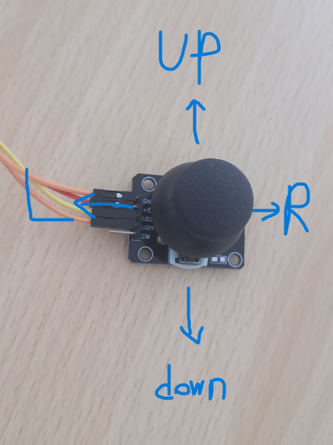

# P11 ADC / Joystick Subsystem Specification

> **Status:** P11 TARGET SPECIFICATION — architecture/specification frozen; RTL/FW/DV implementation and evidence are **(In-progress)**.
>
> **Canonical language:** English. If this file and `kor/15_adc_joystick.ko.md` conflict, this file is authoritative.
>
> **Source anchor:** P11 public worktree `P11-ADC-Cleanup`, HEAD `3be24514d87ed5d6e40361323e6ea8465a4645e6` at P11A preflight review.
>
> **Preflight authority:** Private Issue #4 `[P11A] ADC Cleanup Preflight`, report comment `issuecomment-5830820717`.
>
> **Parent specifications:** `00_soc_architecture.md`, `01_memory_map.md`, `05_apb_subsystem.md`, `06_reset_clock.md`, `19_firmware_contract.md`, `baseline_cleanup.md`.

## 1. Purpose and Scope

This document defines the post-P11 software-visible and project-local architecture for the MAX 10 ADC subsystem and its optional joystick policy consumer.

P11 separates reusable ADC acquisition from board/application interpretation. The architectural boundary is:

```text
MAX 10 ADC / adc_qsys
        |
        v
ADC Acquisition Engine       reusable acquisition / scan-frame owner
        |
        | coherent frame CDC
        v
APB_ADC_Controller           generic software-visible ADC peripheral
        |
        +--> raw ADC MMIO
        |
        +--> Joystick_Policy simple optional hardware child
                  |
                  +--> firmware has an independent policy implementation
```

The P11 baseline remains polling based. No ADC interrupt or PLIC source is introduced by this specification.

The following P11 features are frozen but remain **(In-progress)** until implementation and verification evidence exist:

- sole-owner ADC command engine,
- six-channel-capable internal frame representation,
- CH1/CH2 Clean Baseline scan,
- stable bundled-data req/ack CDC mailbox,
- PCLK LIVE/HOLD snapshot banks,
- CAPTURE-only software lifecycle,
- exact slot-5 MMIO decode and APB error behavior,
- combinational `Joystick_Policy` child,
- independent firmware joystick policy / golden model,
- board polarity and physical joystick acceptance.

## 2. P11 Target Architecture

### 2.1 Complete architecture

```text
                          KEY[0]
                             |
                             v
                system_reset_controller
                             |
                         HRESETn
                             |
          +------------------+----------------------+
          |                  |                      |
          v                  v                      v
      HCLK/PCLK          adc_qsys             reset_release_sync
       domain            vendor IP              adc_sys_clk
          |                  |                      |
          |          command / response             v
          |                  |                 adc_reset_n
          |                  |                      |
          |                  v                      v
          |        +-------------------------------------+
          |        | ADC Acquisition Engine              |
          |        |                                     |
          |        | sole command owner                  |
          |        | MAX_CHANNELS = 6                    |
          |        | baseline active = CH1 / CH2         |
          |        | sample[0..5]                        |
          |        | valid_mask[5:0]                     |
          |        | frame_seq[31:0]                     |
          |        | complete scan-frame assembly        |
          |        +------------------+------------------+
          |                           |
          |                   stable frame payload
          |                           |
          |                    req/ack mailbox
          |                           |
          |===========================|================ CDC
          |                           |
          |                          PCLK
          |                           |
          |                           v
          |                +--------------------+
          |                | ADC LIVE BANK      |
          |                | samples/mask/seq   |
          |                +---------+----------+
          |                          | CAPTURE
          |                          v
          |                +--------------------+
          |                | ADC HOLD BANK      |
          |                | coherent SW view   |
          |                +---------+----------+
          |                          |
          |              +-----------+--------------+
          |              |                          |
          |              v                          v
          |     Generic ADC MMIO             Joystick_Policy
          |                                  combinational
          |                                       |
          +---------------------------------------+
```

### 2.2 Responsibility boundaries

`ADC Acquisition Engine` owns:

- the only project-local Qsys command source,
- active-channel scan order,
- response validation,
- partial-frame state,
- complete-frame publication,
- source-domain frame sequence generation,
- PCLK->ADC ENABLE level synchronization endpoint,
- ADC->PCLK mailbox source endpoint.

`APB_ADC_Controller` owns:

- slot-5 exact MMIO decode,
- ENABLE request register,
- PCLK-visible engine acknowledgement/status,
- LIVE bank,
- CAPTURE-only HOLD bank,
- generic raw-channel registers,
- joystick calibration registers,
- sticky ADC error status,
- frame publication count,
- APB `PREADY` / `PSLVERR` behavior.

`Joystick_Policy` owns only the pure conversion:

```text
HOLD raw CH1/CH2 + current center/deadzone -> F/B/L/R status
```

It shall not contain Qsys, APB, CDC, reset sequencing, MAX 10 IP, or command-scheduler knowledge.

## 3. Vendor Configuration and Physical Mapping

### 3.1 Established generated configuration

P11A established the following generated instance facts from the restricted Quartus/Qsys source and installed Quartus 19.1 Modular ADC metadata:

```text
FPGA device                         = MAX 10 10M50DAF484C7G
Modular ADC mode                    = ADC control core only / external command-response use
board reference clock               = 50 MHz
adc_sys_clk                         = 25 MHz
ADC hard-IP input clock             = 10 MHz
response data width                 = 12 bits
command/response channel width      = 5 bits
analog input mask                   = 63 -> CH1..CH6 enabled in hard-IP config
selected total ADC sampling rate    = 1 MSPS
external reference configuration    = 2.5 V
TSD                                 = disabled
```

The 1 MSPS value is the configured ADC sampling-rate selection. It is **not** inferred from the 10 MHz clock alone and is not, by itself, proof of the project-level scan-frame cadence.

### 3.2 Intel sampling-rate reference

The Intel MAX 10 Analog to Digital Converter User Guide lists Modular ADC sample-rate settings including:

```text
25 kSPS
50 kSPS
100 kSPS
125 kSPS
200 kSPS
250 kSPS
500 kSPS
1 MSPS
```

Not every sampling-rate setting is valid with every ADC input-clock frequency. For the documented combinations relevant here:

| Total ADC rate | Valid ADC input clock(s) used for this reference |
|---:|---|
| 1 MSPS | 2 / 10 / 20 / 40 / 80 MHz |
| 500 kSPS | 10 / 20 / 40 MHz |
| 250 kSPS | 10 / 20 MHz |
| 200 kSPS | 2 MHz |
| 125 kSPS | 10 MHz |
| 100 kSPS | 2 MHz |
| 50 kSPS | 2 MHz |
| 25 kSPS | 2 MHz |

The current generated project uses **1 MSPS / 10 MHz**. At the current 10 MHz ADC input, the guide also permits 500 kSPS, 250 kSPS, and 125 kSPS, but P11 does not change the generated rate setting.

Normative public reference:

- Intel MAX 10 Analog to Digital Converter User Guide, Modular ADC parameter settings and valid sample-rate/input-clock combination.
- https://www.intel.com/programmable/technical-pdfs/683596.pdf

### 3.3 DE10-Lite channel mapping

P11A established the board-level mapping for the referenced DE10-Lite schematic:

```text
Qsys command CH1 -> ADC1IN1 -> board ADC_IN0 -> JP8 pin 1 / Arduino A0
Qsys command CH2 -> ADC1IN2 -> board ADC_IN1 -> JP8 pin 2 / Arduino A1
Qsys command CH3 -> ADC1IN3 -> board ADC_IN2 -> JP8 pin 3 / Arduino A2
Qsys command CH4 -> ADC1IN4 -> board ADC_IN3 -> JP8 pin 4 / Arduino A3
Qsys command CH5 -> ADC1IN5 -> board ADC_IN4 -> JP8 pin 5 / Arduino A4
Qsys command CH6 -> ADC1IN6 -> board ADC_IN5 -> JP8 pin 6 / Arduino A5
```

The command-channel number is therefore one greater than the board `ADC_INx` label for these six user analog inputs.

The Clean Baseline active scan is fixed to command channels CH1 and CH2. The default joystick policy interprets CH1 as logical X and CH2 as logical Y. The physical wiring, orientation, and empirical direction mapping were physically characterized and verified on DE10-Lite hardware under Issue #6 (C4-C), as specified in §3.4.

### 3.4 Physical Joystick Reference Orientation and Direction Mapping

The physical 2-axis analog joystick module (potentiometer voltage divider) is referenced to the operator perspective shown below:



#### Physical Setup & Wiring:
- **Module Physical Orientation**: The potentiometer module is positioned on the bench with its 5-pin header (`GND`, `+5V`, `VRX`, `VRY`, `SW`) facing **LEFT** (`L`, 9 o'clock).
- **Operator Perspective**: The operator is seated at the **DOWN** position (6 o'clock) looking forward toward the **UP** direction (12 o'clock).
- **DE10-Lite Header Wiring**:
  - `GND` $\rightarrow$ DE10-Lite `GND`
  - `+5V` $\rightarrow$ DE10-Lite `3.3V` (power rail for linear potentiometer wipers)
  - `VRX` $\rightarrow$ Arduino Header `A0` (`PIN_C7` / `ADC1IN1` / Command Channel 1)
  - `VRY` $\rightarrow$ Arduino Header `A1` (`PIN_C8` / `ADC1IN2` / Command Channel 2)

#### Empirical Direction & Polarity Mapping (Verified over 2.81M Frames):
Physical deflection of the thumbstick yields the following analog voltage responses and direction classifications:

| Operator Motion | Direction Vector | Active Axis | Raw ADC Response | HW `JOY_STATUS` | ASCII Telemetry |
|---|---|---|---|---|---|
| **Rest Neutral** | Neutral Center | Both | $\text{CH1} \approx 1859$, $\text{CH2} \approx 1958$ | `0x30` (`X_VALID \| Y_VALID`) | `'C'` |
| **Push Forward** | **UP** (12 o'clock) | Vertical (Y) | $\text{CH2} \uparrow$ to $\sim 3803$ (CH1 stable at $1859$) | `0x31` (`FORWARD`) | `'w'` |
| **Pull Backward**| **DOWN** (6 o'clock) | Vertical (Y) | $\text{CH2} \downarrow$ to $\sim 15$ (CH1 stable at $1859$) | `0x32` (`BACKWARD`) | `'s'` |
| **Push Left** | **LEFT** (`L`, 9 o'clock) | Horizontal (X) | $\text{CH1} \downarrow$ to $\sim 16$ (CH2 stable at $1959$) | `0x34` (`LEFT`) | `'a'` |
| **Push Right** | **RIGHT** (`R`, 3 o'clock)| Horizontal (X) | $\text{CH1} \uparrow$ to $\sim 3808$ (CH2 stable at $1959$) | `0x38` (`RIGHT`) | `'d'` |

- **Cross-Axis Isolation**: Deflections along either axis exhibit $< 0.1\%$ cross-axis interference ($\Delta < 2$ counts out of 4095 on the orthogonal channel).
- **Hardware/Software Oracle Agreement**: The hardware status register `ADC_JOY_STATUS` and the software golden model `joystick_policy_eval()` match with 100.0% consistency across all physical motions.

## 4. ADC Scan-Frame Semantics

### 4.1 Frame, not simultaneous sampling

An ADC scan frame is a **coherent publication unit**, not a simultaneous analog sample.

For active channels scanned sequentially:

```text
sample CH1 at t0
sample CH2 at t0 + Ts
...
sample CHN at t0 + (N-1)*Ts
```

The completed values are grouped under one frame identity only after the active scan is complete.

P11 atomicity means:

- all samples in one software-visible HOLD snapshot belong to one completed scan frame,
- one frame cannot contain CH1 from one scan and CH2 from another,
- CDC publication transfers the completed frame as one stable record,
- CAPTURE copies one complete LIVE frame to HOLD on one PCLK edge.

P11 atomicity does **not** mean that all analog channels were sampled at the same physical instant.

### 4.2 Ideal timing equations

For total ADC sample rate `Fs`:

```text
Ts = 1 / Fs
first-to-last skew = (N - 1) * Ts
ideal N-channel frame sampling interval = N * Ts
```

The equations describe ideal continuous conversion scheduling. Project command/response handshaking, mailbox backpressure, and acquisition-engine policy may increase the actual frame interval.

### 4.3 Representative frame-skew table

| Intel sample-rate setting | Adjacent `Ts` | 2-channel first-to-last skew | 2-channel ideal sample interval | 6-channel first-to-last skew | 6-channel ideal sample interval |
|---:|---:|---:|---:|---:|---:|
| 1 MSPS | 1 us | 1 us | 2 us | 5 us | 6 us |
| 500 kSPS | 2 us | 2 us | 4 us | 10 us | 12 us |
| 250 kSPS | 4 us | 4 us | 8 us | 20 us | 24 us |
| 200 kSPS | 5 us | 5 us | 10 us | 25 us | 30 us |
| 125 kSPS | 8 us | 8 us | 16 us | 40 us | 48 us |
| 100 kSPS | 10 us | 10 us | 20 us | 50 us | 60 us |
| 50 kSPS | 20 us | 20 us | 40 us | 100 us | 120 us |
| 25 kSPS | 40 us | 40 us | 80 us | 200 us | 240 us |

This table is a timing illustration across Intel-supported sampling-rate settings. It does not state that all rows are valid with the current 10 MHz ADC input clock. The current generated setting is specifically **1 MSPS with 10 MHz input**.

### 4.4 Current configured timing

For the current generated 1 MSPS setting:

```text
Ts                               = 1 us
baseline CH1 -> CH2 ideal skew   = 1 us
baseline 2-channel ideal interval= 2 us
future 6-channel first-last skew = 5 us
future 6-channel ideal interval  = 6 us
```

The effective P11 scan-frame cadence is **(In-progress)** and shall be measured from accepted command / response timestamps after the acquisition engine is implemented. The specification shall not equate the 2 us ideal two-channel interval with a measured end-to-end frame period until that evidence exists.

## 5. Acquisition Engine Contract

### 5.1 Structural scalability

The engine shall be structurally capable of representing six user ADC slots:

```text
sample[0] <-> command CH1
sample[1] <-> command CH2
sample[2] <-> command CH3
sample[3] <-> command CH4
sample[4] <-> command CH5
sample[5] <-> command CH6
```

Baseline configuration:

```text
MAX_CHANNELS = 6
ACTIVE_MASK  = 6'b000011
scan order   = CH1, CH2
```

Runtime-programmable scan masks/channel lists are not part of P11.

### 5.2 Sole command ownership

Only the ADC acquisition engine may drive the project-local Qsys command interface.

The historical top-level scanner and the historical APB-local disconnected command generator shall not coexist as command owners after P11.

### 5.3 Response acceptance

The generated response interface has no project-visible response-ready/backpressure input. The engine shall therefore be capable of accepting/validating a response whenever the vendor interface asserts response-valid.

The engine shall validate at minimum:

- expected channel identity,
- no duplicate active channel in one frame,
- expected baseline scan order,
- SOP/EOP shape required by the single-command packet contract.

On a malformed response:

```text
partial frame -> discard
no frame_seq increment
no mailbox publication
sticky ERROR_STATUS bit -> set
assembly -> restart from CH1 when enabled
```

### 5.4 Complete frame

Baseline complete frame condition:

```text
CH1 accepted and stored
CH2 accepted and stored
valid_mask == 6'b000011
no frame error
```

Only a complete frame may increment source `frame_seq` and be offered to the CDC mailbox.

### 5.5 Frame sequence

`frame_seq` is a 32-bit modulo counter.

```text
reset                         -> 0
first complete frame          -> 1
each later complete frame     -> previous + 1 modulo 2^32
partial/error frame           -> no increment
```

Sequence identity is a digital publication identifier, not an analog timestamp.

## 6. ENABLE Control and PCLK -> ADC CDC

### 6.1 Software-visible request

`ADC_CTRL.ENABLE` is a persistent PCLK-domain level named `ENABLE_REQ` in the architectural model.

Unlike frame transfer, ENABLE does not require a bundled-data mailbox because it is a stable one-bit level rather than a pulse or multi-bit payload.

The approved mechanism is:

```text
PCLK ENABLE_REQ
      |
      v
2+ FF level synchronizer in adc_sys_clk
      |
      v
engine enable state
      |
      v
ENGINE_ENABLED level synchronized back to PCLK
```

`ADC_STATUS.ENABLE_REQ` reports the requested state. `ADC_STATUS.ENGINE_ENABLED` reports the acknowledged engine state.

### 6.2 Enable transition

On synchronized `0 -> 1`:

- clear any stale partial assembly,
- begin a new scan at CH1,
- permit command issue,
- assert engine-enabled acknowledgement only when the engine has entered the enabled scan state.

### 6.3 Disable transition

On synchronized `1 -> 0`:

- issue no new commands after the disable request is recognized,
- consume any unavoidable already-accepted response only to safely quiesce the vendor interface,
- do not use such trailing traffic to publish a new frame after disable recognition,
- discard the current partial frame,
- invalidate LIVE eligibility after the disabled state is acknowledged,
- preserve the last HOLD snapshot for software readback,
- deassert `ENGINE_ENABLED` after the engine is quiescent.

A disable transition shall never publish a partial frame.

## 7. ADC -> PCLK CDC Mailbox

### 7.1 Baseline mechanism

Completed frames cross from 25 MHz `adc_sys_clk` to 50 MHz PCLK through a stable bundled-data request/acknowledge toggle mailbox.

Source sequence:

```text
1. assemble complete frame
2. write stable payload register
3. toggle REQ
4. hold payload unchanged while mailbox busy
5. wait until synchronized ACK matches REQ
6. only then permit next frame publication
```

Destination sequence:

```text
1. synchronize REQ into PCLK
2. detect REQ change
3. capture entire stable payload into LIVE on one PCLK edge
4. increment PCLK FRAME_COUNT
5. toggle/return ACK
```

The mailbox payload contains at least:

```text
frame_seq[31:0]
valid_mask[5:0]
sample CH1..CH6 representation
```

Baseline CH3..CH6 values are architecturally zero/invalid.

### 7.2 Backpressure policy

P11 chooses a lossless-at-publication mailbox policy: the acquisition engine shall not overwrite the mailbox payload or publish a second completed frame while the previous frame is awaiting acknowledgement.

The engine may pause at the frame boundary while mailbox busy. P11 therefore prioritizes coherent/lossless frame publication over maximum raw ADC throughput.

### 7.3 When an asynchronous FIFO becomes necessary

The mailbox is no longer sufficient when any of the following becomes an architectural requirement:

- the producer must continue creating complete frames while the destination has not acknowledged the previous frame,
- more than one completed frame may accumulate per CDC round trip,
- every high-rate frame must be retained without pausing the ADC scheduler,
- destination stalls may be long or unbounded while acquisition must continue,
- burst acquisition is required,
- ADC samples become a continuous data stream for DMA/external SDRAM,
- queue occupancy/depth/overflow becomes software-visible state.

Typical future example:

```text
1 MSPS ADC streaming
    -> async FIFO
    -> AXI/DMA
    -> external SDRAM
```

Such a streaming architecture is outside P11 and shall not be inferred from this latest-state MMIO peripheral.

## 8. PCLK LIVE / HOLD Snapshot Contract

### 8.1 LIVE bank

LIVE is updated only by a successfully received mailbox publication.

LIVE contains:

```text
LIVE_SEQ
LIVE_VALID_MASK
LIVE_CH1..CH6
LIVE_VALID
```

`LIVE_VALID` is cleared by reset and by acknowledged acquisition disable. It becomes one after the first valid post-enable frame reaches PCLK.

### 8.2 HOLD bank

HOLD is the coherent software snapshot:

```text
HOLD_SEQ
HOLD_VALID_MASK
HOLD_CH1..CH6
HOLD_VALID
```

Only CAPTURE or reset may modify HOLD.

### 8.3 NEW_FRAME

The approved P11 software-visible predicate is:

```text
NEW_FRAME = LIVE_VALID && (!HOLD_VALID || LIVE_SEQ != HOLD_SEQ)
```

Because `SEQ` is finite, equality after an exact 2^32-frame lapse is theoretically indistinguishable from no change. Firmware shall not leave one HOLD snapshot unrefreshed across 2^32 published frames if it relies on `NEW_FRAME` as the only freshness predicate.

### 8.4 CAPTURE-only lifecycle

`ADC_CTRL.CAPTURE` is a write-one pulse command.

If `NEW_FRAME=1` when the command is accepted:

```text
HOLD samples     <- LIVE samples
HOLD_VALID_MASK  <- LIVE_VALID_MASK
HOLD_SEQ         <- LIVE_SEQ
HOLD_VALID       <- 1
```

The copy is atomic in PCLK.

If `NEW_FRAME=0`:

- the APB transaction returns normal OKAY,
- CAPTURE is a no-op,
- HOLD remains unchanged,
- no error bit is set.

“No new frame” is runtime state, not malformed MMIO. It shall not set `ERROR_STATUS`, consume or invalidate the current HOLD snapshot, modify `HOLD_SEQ`, or create a synthetic sequence/count event. This keeps polling simple: software may attempt CAPTURE opportunistically without turning normal producer/consumer timing into a bus fault.

The observable cases are therefore:

| Pre-command state | CAPTURE result | HOLD after completion | Bus/error result |
|---|---|---|---|
| LIVE invalid, HOLD invalid | no-op | invalid/unchanged | OKAY, no error |
| LIVE invalid, HOLD valid | no-op | previous HOLD retained | OKAY, no error |
| LIVE valid and HOLD invalid | copy LIVE | new valid HOLD | OKAY |
| LIVE valid and `LIVE_SEQ != HOLD_SEQ` | replace HOLD with LIVE | newer HOLD | OKAY |
| LIVE valid and `LIVE_SEQ == HOLD_SEQ` | no-op | previous HOLD retained | OKAY, no error |

A later successful CAPTURE replaces the previous HOLD snapshot. There is no RELEASE command. This contract deliberately makes CAPTURE idempotent with respect to a non-new LIVE generation and lets firmware use either `NEW_FRAME` pre-checking or unconditional CAPTURE attempts without divergent error handling.

### 8.5 Difference from P09 G-sensor

P09 G-sensor intentionally uses an ownership lifecycle:

```text
CAPTURE -> CPU-owned HOLD -> RELEASE
```

ADC P11 instead models the latest coherent analog state:

```text
CAPTURE -> HOLD
next CAPTURE -> replace HOLD
```

ADC HOLD does not block acquisition and is not a queue entry requiring explicit ownership release. Adding RELEASE would increase API state without providing useful ownership semantics for this latest-state ADC contract.

## 9. APB / MMIO Contract

### 9.1 Base and access width

```text
ADC_BASE = 0x4005_0000
APB slot = PSEL[5]
access   = naturally aligned 32-bit words only
```

P11 replaces the architectural name “ADC Joystick peripheral” with **generic ADC peripheral with optional joystick policy**. A transitional `JOYSTICK_BASE` firmware alias may temporarily point to the same address during migration, but new code shall use `ADC_BASE`.

The APB slave remains zero-wait for valid accesses:

```text
PREADY = 1
```

It shall expose `PSLVERR` for invalid direction/reserved/unmapped/unsupported accesses and route the error through the existing bridge AHB error path.

### 9.2 Exact v2 register map

| Offset | Register | Access | Reset / baseline | Description |
|---:|---|---|---|---|
| `0x00` | `NAME0` | RO | `"apb-"` | identification |
| `0x04` | `NAME1` | RO | `"adc "` | generic ADC identification |
| `0x08` | `VERSION` | RO | `0x0002_0000` | ABI major 2, minor 0 |
| `0x0C` | `ADC_CTRL` | RW/W1P | `0` | ENABLE + commands |
| `0x10` | `ADC_STATUS` | RO | dynamic | request/engine/bank/mailbox/error state |
| `0x14` | `FRAME_SEQ` | RO | `0` | HOLD sequence |
| `0x18` | `VALID_MASK` | RO | `0` | HOLD valid mask |
| `0x1C` | `CH1_RAW` | RO | `0` | HOLD CH1 [11:0] |
| `0x20` | `CH2_RAW` | RO | `0` | HOLD CH2 [11:0] |
| `0x24` | `CH3_RAW` | RO reserved channel | `0` | reserved canonical address |
| `0x28` | `CH4_RAW` | RO reserved channel | `0` | reserved canonical address |
| `0x2C` | `CH5_RAW` | RO reserved channel | `0` | reserved canonical address |
| `0x30` | `CH6_RAW` | RO reserved channel | `0` | reserved canonical address |
| `0x34` | `LIVE_SEQ` | RO | `0` | latest PCLK LIVE sequence |
| `0x38` | `LIVE_VALID_MASK` | RO | `0` | latest PCLK LIVE mask |
| `0x3C` | `ACTIVE_MASK` | RO | `0x03` | fixed Clean Baseline active channels |
| `0x40` | `JOY_CENTER_X` | RW | `2048` | current HW/FW policy parameter |
| `0x44` | `JOY_CENTER_Y` | RW | `2048` | current HW/FW policy parameter |
| `0x48` | `JOY_DEADZONE` | RW | `300` | current HW/FW policy parameter |
| `0x4C` | `JOY_STATUS` | RO | dynamic | combinational policy over HOLD |
| `0x50..0x5C` | reserved | none | n/a | ERROR on access |
| `0x60` | `FRAME_COUNT` | RO | `0` | successful PCLK LIVE publications |
| `0x64` | `ERROR_STATUS` | RO | `0` | sticky acquisition error bits |
| `0x68..0xFC` | reserved | none | n/a | ERROR on access |

CH3..CH6 addresses are intentionally reserved now so future six-channel activation does not require a raw-data ABI relocation. In the Clean Baseline they return zero and their HOLD/LIVE valid-mask bits remain clear.

### 9.3 `ADC_CTRL`

| Bit | Name | Access | Meaning |
|---:|---|---|---|
| 0 | `ENABLE` | RW | persistent acquisition request level |
| 1 | `CAPTURE` | W1P | attempt LIVE -> HOLD atomic copy |
| 2 | `CLEAR_ERROR` | W1P | clear sticky `ERROR_STATUS` bits |
| 31:3 | reserved | none | must write zero; nonzero reserved writes are ERROR |

Reading `ADC_CTRL` returns only the stored `ENABLE` level; command bits read zero.

### 9.4 `ADC_STATUS`

| Bit | Name | Meaning |
|---:|---|---|
| 0 | `ENABLE_REQ` | PCLK software request level |
| 1 | `ENGINE_ENABLED` | synchronized engine acknowledgement |
| 2 | `LIVE_VALID` | at least one eligible current LIVE frame |
| 3 | `HOLD_VALID` | HOLD contains a captured frame |
| 4 | `NEW_FRAME` | LIVE is newer than HOLD under Section 8.3 |
| 5 | `MAILBOX_BUSY` | source frame awaiting acknowledgement |
| 6 | *reserved* | read zero |
| 7 | `ERROR_PENDING` | `ERROR_STATUS != 0` |
| 31:8 | reserved | read zero |

All software-visible status bits shall be PCLK-domain state or safely synchronized/captured state. No live asynchronous Qsys bus field may be exposed directly.

### 9.5 `ERROR_STATUS`

Sticky bits:

| Bit | Name | Meaning |
|---:|---|---|
| 0 | `UNEXPECTED_CHANNEL` | response channel not valid for the expected active scan slot |
| 1 | `DUPLICATE_CHANNEL` | same active channel observed twice within one frame |
| 2 | `ORDER_ERROR` | baseline CH1 -> CH2 ordering contract violated |
| 3 | `PACKET_ERROR` | SOP/EOP contract malformed |
| 31:4 | reserved | read zero |

A source error shall discard the partial frame and set the corresponding sticky PCLK-visible error indication through an implementation-defined safe event/status transfer. `ADC_CTRL.CLEAR_ERROR` clears all sticky error bits; a coincident new hardware error is set-dominant.

### 9.6 `FRAME_COUNT`

`FRAME_COUNT` increments exactly once when a complete source frame is successfully accepted into the PCLK LIVE bank through the mailbox.

It does **not** count:

- individual ADC responses,
- commands,
- CAPTURE operations,
- discarded partial/error frames.

It resets to zero only on system reset in P11 baseline.

### 9.7 Invalid access policy

The P11 ADC slot shall use exact full local-offset validation.

The bridge allowlist shall admit only architecturally implemented offsets. Low-bit aliases such as `+0x100` mirrors are not permitted.

The following return APB error / propagated AHB error with no side effect:

- non-word access,
- misaligned direct bus access,
- write to RO register,
- read/write of unimplemented reserved offsets,
- malformed `ADC_CTRL` write with reserved bits set,
- any slot-local offset not listed as architecturally valid.

An eligible `CAPTURE` that finds no new frame is **not** an error; it is an OKAY no-op.

## 10. Joystick Hardware Policy

### 10.1 Child-module seam

The target child interface is conceptually:

```text
inputs:
  hold_ch1[11:0]
  hold_ch2[11:0]
  hold_valid_mask[5:0]
  center_x[11:0]
  center_y[11:0]
  deadzone[11:0]

outputs:
  forward
  backward
  left
  right
  x_valid
  y_valid
```

The exact RTL port names may differ, but the dependency boundary shall not.

### 10.2 Combinational policy

`Joystick_Policy` is combinational over the current HOLD sample and the **current** calibration registers.

Approved policy:

```text
JOY_STATUS = current policy parameters applied to current HOLD sample
```

Therefore, changing center/deadzone may change `JOY_STATUS` immediately without changing `HOLD_SEQ` or raw HOLD data.

Calibration values are not snapshotted by CAPTURE.

### 10.3 Threshold arithmetic

Default values:

```text
CENTER_X = 2048
CENTER_Y = 2048
DEADZONE = 300
```

Use widened arithmetic and saturating conceptual thresholds:

```text
high_x = min(4095, center_x + deadzone)
low_x  = max(0,    center_x - deadzone)
high_y = min(4095, center_y + deadzone)
low_y  = max(0,    center_y - deadzone)

RIGHT    = x_valid && x_raw > high_x
LEFT     = x_valid && x_raw < low_x
FORWARD  = y_valid && y_raw > high_y
BACKWARD = y_valid && y_raw < low_y
```

The RTL may implement low-side comparison with 13-bit addition/comparison to avoid unsigned underflow, provided it is mathematically equivalent to the clamped policy.

### 10.4 `JOY_STATUS`

| Bit | Name |
|---:|---|
| 0 | `FORWARD` |
| 1 | `BACKWARD` |
| 2 | `LEFT` |
| 3 | `RIGHT` |
| 4 | `X_VALID` |
| 5 | `Y_VALID` |
| 31:6 | zero |

Physical X/Y polarity and final LEFT/RIGHT mapping remain **(In-progress)** board acceptance. The logical bit definitions above shall not be silently reversed to preserve a historical ASCII quirk.

## 11. Firmware Policy and Golden-Model Contract

Firmware shall implement an independent policy function over the same coherent HOLD raw sample and current calibration values.

Recommended separation:

```text
adc driver
  -> adc_frame_t
       -> joystick_policy_eval()     independent C reference
       -> optional read JOY_STATUS   hardware result
```

The firmware policy shall not derive its expected result by reading `JOY_STATUS`; it must recompute the policy independently.

Verification may therefore compare:

```text
HW JOY_STATUS == FW joystick_policy_eval(HOLD, current calibration)
```

for directed and randomized vectors.

Board/application mapping of logical direction to ASCII/control commands belongs above this generic policy layer. Conventional WASD mapping should be used only after physical X/Y polarity is confirmed.

## 12. Reset Architecture

### 12.1 System versus generated-domain reset

The system reset controller owns external reset conditioning and HCLK-qualified reset release.

```text
                             KEY[0]
                               |
                               v
                    +---------------------+
                    | System Reset        |
                    | Controller          |
                    |                     |
                    | input conditioning  |
                    | ~20 ms qualification|
                    +----------+----------+
                               |
                            HRESETn
                               |
             +-----------------+------------------+
             |                                    |
             v                                    v
        HCLK / PCLK                        generated domains
   already HCLK-qualified                 (example: ADC)
                                                  |
                                                  v
                                      reset_release_sync
                                          adc_sys_clk
                                                  |
                                                  v
                                            adc_reset_n
```

HCLK/PCLK shall not receive an extra release synchronizer solely for stylistic uniformity because `HRESETn` is already released in the HCLK domain and PCLK equals HCLK.

### 12.2 Project-local ADC reset

Project-local ADC acquisition logic shall use asynchronous assertion / `adc_sys_clk`-synchronous deassertion through the reusable `reset_release_sync` primitive.

The P11 architectural name for this project-local reset is `adc_reset_n`.

### 12.3 Vendor Qsys reset / PLL lock boundary

`adc_qsys` receives qualified `HRESETn` at its vendor reset port. Generated Qsys reset controllers and PLL-lock routing remain a vendor-managed boundary.

P11A established:

- Qsys internally uses PLL lock information,
- PLL `locked` is not exported to project-local top RTL,
- project-local ADC reset release is clock-domain synchronized but not directly lock-qualified by an exported signal.

P11 implementation shall not hand-edit generated vendor HDL merely to expose `locked`.

Exact vendor command-ready/lock-loss/recovery behavior remains **(In-progress)** verification. Until proven otherwise, the project acquisition engine shall rely on its local synchronized reset plus the vendor command-ready interface and shall not issue a command before local reset release.

## 13. Interrupt Policy

P11 remains polling based.

There is no ADC/joystick PLIC source in this specification.

Any future interrupt architecture shall separately define:

- frame-ready versus threshold/direction events,
- enable/status/W1C semantics,
- overflow or coalescing behavior,
- PLIC source allocation.

## 14. Verification and Acceptance Requirements

All P11 acceptance work is **(In-progress)** until evidence is attached to the P11 implementation/closure flow.

### 14.1 Command ownership and ENABLE

Verify:

- one project-local command owner only,
- CH1 -> CH2 scan order,
- no command before `adc_reset_n` release,
- stable level ENABLE request synchronization,
- no new command after synchronized disable recognition,
- partial frame discarded on disable,
- re-enable restarts from CH1.

### 14.2 Vendor protocol / cadence

With the real generated interface or an evidence-qualified vendor simulation/trace, measure:

- accepted command -> response latency,
- whether multiple responses may be internally outstanding,
- response-valid behavior without response-ready,
- achieved two-channel frame interval,
- relationship between selected 1 MSPS rate and project-level frame cadence.

### 14.3 Frame and CDC

Use unrelated/asynchronous clock phases and an independent transaction ledger to prove:

- no torn frame,
- no mixed CH1/CH2 generation,
- source payload stable while mailbox busy,
- exactly one PCLK LIVE update per acknowledged frame,
- exact sequence/mask/count behavior,
- reset/disable cannot publish stale or partial data.

### 14.4 APB / bridge

Verify exact offsets, 32-bit-only policy, RO/reserved errors, no `+0x100` mirror, and end-to-end `PSLVERR -> HRESP` behavior with no invalid side effects.

### 14.5 CAPTURE

Verify:

- successful atomic replacement,
- repeated CAPTURE without new frame is OKAY/no-op,
- HOLD persists across acquisition disable,
- no RELEASE command exists,
- rapid LIVE updates do not tear HOLD.

### 14.6 HW/FW policy equivalence

Independent vectors shall include:

- exact center/deadzone boundaries,
- 0 and 4095 extremes,
- center < deadzone and center + deadzone > 4095,
- invalid X/Y valid mask,
- calibration changes without new CAPTURE,
- randomized raw/calibration combinations,
- board polarity test separately from logical policy.

### 14.7 Quartus / TimeQuest / board

P11 shall collect scoped evidence for:

- ADC generated clocks,
- reset recovery/removal,
- residual ADC/VGA placement warnings,
- analog JP8 configuration,
- joystick center and polarity,
- ADC behavior with relevant VGA activity.

P11 evidence shall not by itself promote global `STA-001` or `STA-002` to closed.

## 15. P11 Requirement Mapping

| Tracker ID | P11 target | Freeze status |
|---|---|---|
| `ADC-001` | sole acquisition-engine command owner | (In-progress) |
| `ADC-002` | real ENABLE request/ack; fixed RO baseline channel configuration | (In-progress) |
| `ADC-003` | coherent frame + sequence/mask/error + CAPTURE HOLD | (In-progress) |
| `ADC-004` | physical X/Y polarity and direction mapping board acceptance | (In-progress) |
| `ADC-005` | generic ADC / optional joystick seam; no live async debug MMIO | (In-progress) |
| `ADC-006` | async-clock, MMIO, HW/FW policy, Quartus and board regressions | (In-progress) |
| `CDC-003` | stable frame req/ack mailbox | (In-progress) |
| `FW-009` | coherent ADC API + independent FW joystick policy | (In-progress) |
| `APB-005` ADC sub-scope | exact local offsets, no mirrors | (In-progress) |

## 16. Baseline Invariants After P11 Closure

After implementation and verification, the intended P11 invariants are:

```text
APB base                         = 0x4005_0000
architectural peripheral         = generic ADC + optional joystick policy
project-local command owner      = ADC Acquisition Engine only
structural channel capacity      = 6
Clean Baseline active channels   = CH1, CH2
configured ADC sample rate       = 1 MSPS
ADC input clock                  = 10 MHz
adc_sys_clk                      = 25 MHz
raw sample width                 = 12 bits
frame atomicity                  = coherent publication, not simultaneous sampling
ADC->PCLK CDC                    = stable bundled-data req/ack mailbox
software snapshot                = LIVE + CAPTURE-only HOLD
RELEASE                          = none
ENABLE                           = real level request + engine acknowledgement
CH3..CH6 raw MMIO                = reserved canonical addresses
joystick HW policy               = stateless combinational child over HOLD
joystick FW policy               = independent reference/golden function
interrupt                        = none / polling
```

Do not replace `(In-progress)` with `Verified` solely because this specification is frozen.

## 17. Historical / Pre-P11 Baseline

This appendix preserves only the pre-cleanup facts needed to explain P11. It is not the target contract.

Before P11:

- a top-level CH1/CH2 scanner drove the real Qsys commands,
- `APB_ADC_Joystick_Controller` contained a second disconnected command generator,
- `CTRL.ENABLE` controlled only that dead local generator,
- writable X/Y channel registers classified responses but did not change actual conversion channels,
- Qsys response valid/channel/data/SOP/EOP crossed directly from `adc_sys_clk` to PCLK without project RTL CDC,
- X and Y were updated independently and could represent different generations,
- live asynchronous command/response debug fields were exposed through `STATUS`/`RESP_INFO`,
- software read direction/X/Y in separate transactions without an atomic frame identity,
- no reusable generic ADC MMIO boundary existed,
- historical firmware mapped LEFT/RIGHT to reversed `d/a` ASCII values pending physical polarity confirmation.

Those behaviors are retained for provenance only and shall not constrain the P11 implementation.

## 18. Related Specifications

- `00_soc_architecture.md`
- `01_memory_map.md`
- `05_apb_subsystem.md`
- `06_reset_clock.md`
- `19_firmware_contract.md`
- `baseline_cleanup.md`
- Intel MAX 10 Analog to Digital Converter User Guide
